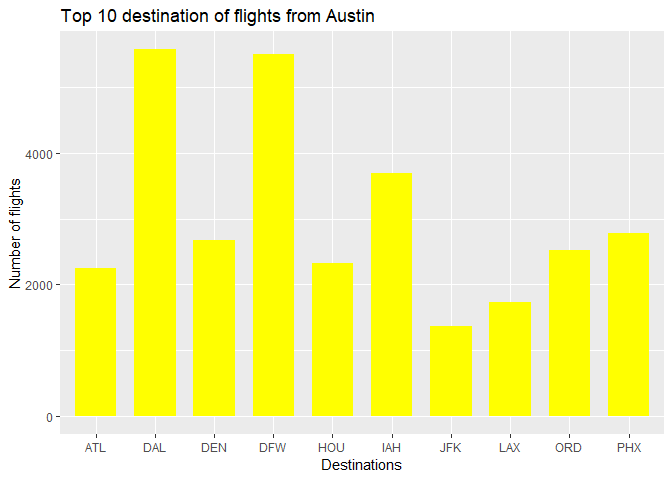

Assignment 380- Exercises 2
================

Problem 1 - Abia
----------------

### "Your task is to create a figure, or set of related figures, that tell an interesting story about flights into and out of Austin. You can annotate the figure and briefly describe it, but strive to make it as stand-alone as possible. It shouldn't need many, many paragraphs to convey its meaning. Rather, the figure should speak for itself as far as possible."

    ## Warning: package 'ggplot2' was built under R version 3.4.4

#### To answer this question, we are going to address a wide range of questions in an attempt to achieve an overall better understanding of the flights that occus at the Austin-Bergstrom Interational Airport.

#### These include addressing questions like:

#### 1. The Biggest Carrier at this airport

#### 2. The most popular flights flying into and out of Austin

#### 3. The frequency of flights from the most popular locations

#### 4. Comparing 'Short' and 'Long' flights

#### 5. Determining performance in terms of the day of the week and time of day

#### 6. Incorporating weather into the analysis

#### Answering these questions, and even a few more, will allow us to gain a better grasp of some interesting findings at the ATX airport and display a unique story

#### To begin, we will try to identify the biggest carrier associated with the Austin airport:


#### Based on the graph, it looks like WN and AA are the two biggest carriers in Austin (about a decade ago- 2008)

#### Now we will see the number of flights arriving in Austin


#### These are the top 10 origins with flights landing in Austin. DAL and DFW (Dallas and Dallas-Fort Worth) host the majority of flights

#### Now we will transition to observe flights departing from Austin



#### It appers as if most of the flights starting from Austin are directed towards the above mentioned top 10 destinations. Again, the majority of the flights are for Dallas

#### Now lets see the frequency of the flights from these top 10 locations to Austin

    ## Warning in RColorBrewer::brewer.pal(n, pal): n too large, allowed maximum for palette Dark2 is 8
    ## Returning the palette you asked for with that many colors

    ## Warning: Removed 24 rows containing missing values (geom_path).

    ## Warning: Removed 24 rows containing missing values (geom_point).


#### Looks like number of flights originating from Dallas are reducing from approximately the middle of the year

    ## Warning in RColorBrewer::brewer.pal(n, pal): n too large, allowed maximum for palette Dark2 is 8
    ## Returning the palette you asked for with that many colors

    ## Warning: Removed 24 rows containing missing values (geom_path).

    ## Warning: Removed 24 rows containing missing values (geom_point).


### We can see a similar drop in Austin to Dallas flights from the middle of the year. We can deduc that something likely went wrong here

#### Lets try to understand and see WHY there was a sudden drop in flights originating and departing from Dallas to Austin


#### The MQ carrier stopped its service after June, and this clearly explains the drop in the Dallas flights. This was an interseting finding that tells a story as to WHY there was a drop in the occurrence of Dallas flights.

#### We will now take a look at the percentage of flights cancelled for each airline carrier


#### We will now check frequency of short and long distance flights

#### (Flights originating from Austin)


#### (Flights landing in Austin)


#### Taxi-out time of flights starting from Austin to the top 10 airports

    ## Warning: Removed 572 rows containing non-finite values (stat_boxplot).


#### To our surprise, it does NOT Look like the day of the week really matters here. (It does not appear to play too significant of a factor)

    ## Warning: Removed 572 rows containing non-finite values (stat_boxplot).


#### Based on the analysis, it looks like the bigger airlines that we observed earlier- like AA and WN- are given higher preference to take off and therefore have lower taxi-out time than some other airlines

    ## Warning: Removed 572 rows containing non-finite values (stat_boxplot).


#### To gain a better understanding of trends in the Time of Day, we wanted to see which times appeared to be the busiest. It looks like the morning time of 6:00am - 8:00am and afternoon times between 3:00pm - 6:00pm are the busisest times

#### Reasons of delay for the flights originating from Austin - to top 10 airports

#### %flights with Carrier Delay by carrier


#### % flights with weather delay by month


Problem 2 - Author Attribution
------------------------------

``` r
rm(list = ls())

library(tm)
```

    ## Warning: package 'tm' was built under R version 3.4.4

    ## Loading required package: NLP

    ## 
    ## Attaching package: 'NLP'

    ## The following object is masked from 'package:ggplot2':
    ## 
    ##     annotate

``` r
library(e1071)
```

    ## Warning: package 'e1071' was built under R version 3.4.4

``` r
library(randomForest)
```

    ## Warning: package 'randomForest' was built under R version 3.4.4

    ## randomForest 4.6-14

    ## Type rfNews() to see new features/changes/bug fixes.

    ## 
    ## Attaching package: 'randomForest'

    ## The following object is masked from 'package:ggplot2':
    ## 
    ##     margin

``` r
library(caret)
```

    ## Warning: package 'caret' was built under R version 3.4.4

    ## Loading required package: lattice

``` r
library(ggplot2)
library(stringr)
```

    ## Warning: package 'stringr' was built under R version 3.4.4

``` r
library(plyr)
```

    ## Warning: package 'plyr' was built under R version 3.4.4

``` r
## Creating reader function
readerPlain = function(fname){
  readPlain(elem=list(content=readLines(fname)), 
            id=fname, language='en')}

author_texts = Sys.glob('../data/ReutersC50/C50train/*')
## Testing the author texts
author_texts[[1]]
```

    ## [1] "../data/ReutersC50/C50train/AaronPressman"

``` r
#my_path = author_texts[[1]]
#word(my_path, -1, sep = "/")
all_files = NULL
train_labels = NULL
### creating training labels
for (name in author_texts)
{
  files_to_add = Sys.glob(paste0(name, '/*.txt'))
  all_files = append(all_files, files_to_add)
  y = word(name, -1, sep = "/")
  train_labels = append(train_labels, rep(y, length(files_to_add)))
}

all_texts = lapply(all_files, readerPlain) 
names(all_texts) = all_files
names(all_texts) = sub('.txt', '', names(all_texts))

train_corpus = Corpus(VectorSource(all_texts))
#names(train_corpus) = all_files

train_corpus = tm_map(train_corpus, content_transformer(tolower)) 
```

    ## Warning in tm_map.SimpleCorpus(train_corpus, content_transformer(tolower)):
    ## transformation drops documents

``` r
train_corpus = tm_map(train_corpus, content_transformer(removeNumbers)) 
```

    ## Warning in tm_map.SimpleCorpus(train_corpus,
    ## content_transformer(removeNumbers)): transformation drops documents

``` r
train_corpus = tm_map(train_corpus, content_transformer(removePunctuation)) 
```

    ## Warning in tm_map.SimpleCorpus(train_corpus,
    ## content_transformer(removePunctuation)): transformation drops documents

``` r
train_corpus = tm_map(train_corpus, content_transformer(stripWhitespace)) 
```

    ## Warning in tm_map.SimpleCorpus(train_corpus,
    ## content_transformer(stripWhitespace)): transformation drops documents

``` r
train_corpus = tm_map(train_corpus, content_transformer(removeWords), stopwords("SMART"))
```

    ## Warning in tm_map.SimpleCorpus(train_corpus,
    ## content_transformer(removeWords), : transformation drops documents

``` r
DTM_train = DocumentTermMatrix(train_corpus)
DTM_train = removeSparseTerms(DTM_train, 0.975)

inspect(DTM_train[1:10, 1:5])
```

    ## <<DocumentTermMatrix (documents: 10, terms: 5)>>
    ## Non-/sparse entries: 10/40
    ## Sparsity           : 80%
    ## Maximal term length: 11
    ## Weighting          : term frequency (tf)
    ## Sample             :
    ##     Terms
    ## Docs access accounts alliance announced authorities
    ##   1       1        1        1         1           1
    ##   10      4        0        0         0           0
    ##   2       0        0        0         1           0
    ##   3       2        0        0         0           0
    ##   4       0        0        0         1           0
    ##   5       0        0        0         1           0
    ##   6       0        0        0         0           0
    ##   7       0        0        0         0           0
    ##   8       0        0        0         0           0
    ##   9       0        0        0         0           0

Inspecting Document Term Matrix of train, we can proceed further to create the similar one for test data.

``` r
author_dirs = Sys.glob("../data/ReutersC50/C50test/*")
file_list = NULL
test_labels = NULL
for(author in author_dirs) {
  y = word(author, -1, sep = "/")
  files_to_add = Sys.glob(paste0(author, '/*.txt'))
  test_labels = append(test_labels, rep(y, length(files_to_add)))
  file_list = append(file_list, files_to_add)
  
  #test_labels = append(test_labels, rep(author_name, length(files_to_add)))
}

all_docs = lapply(file_list, readerPlain) 
names(all_docs) = file_list
names(all_docs) = sub('.txt', '', names(all_docs))

test_corpus = Corpus(VectorSource(all_docs))

test_corpus = tm_map(test_corpus, content_transformer(tolower)) 
```

    ## Warning in tm_map.SimpleCorpus(test_corpus, content_transformer(tolower)):
    ## transformation drops documents

``` r
test_corpus = tm_map(test_corpus, content_transformer(removeNumbers)) 
```

    ## Warning in tm_map.SimpleCorpus(test_corpus,
    ## content_transformer(removeNumbers)): transformation drops documents

``` r
test_corpus = tm_map(test_corpus, content_transformer(removePunctuation)) 
```

    ## Warning in tm_map.SimpleCorpus(test_corpus,
    ## content_transformer(removePunctuation)): transformation drops documents

``` r
test_corpus = tm_map(test_corpus, content_transformer(stripWhitespace)) 
```

    ## Warning in tm_map.SimpleCorpus(test_corpus,
    ## content_transformer(stripWhitespace)): transformation drops documents

``` r
test_corpus = tm_map(test_corpus, content_transformer(removeWords), stopwords("SMART"))
```

    ## Warning in tm_map.SimpleCorpus(test_corpus,
    ## content_transformer(removeWords), : transformation drops documents

``` r
intersection_dictionary = NULL
intersection_dictionary = dimnames(DTM_train)[[2]]

## Converting test corpus into document term matrix using only dictionary words
DTM_test = DocumentTermMatrix(test_corpus, list(dictionary=intersection_dictionary))
DTM_test = removeSparseTerms(DTM_test, 0.975)
dim(DTM_train)
```

    ## [1] 2500 1411

``` r
dim(DTM_test)
```

    ## [1] 2500 1284

We can clearly see that DTM\_train and DTM\_test have different dimensions. So, we did the following the ensure the exact same dimensions: 1.) Make the term frequency for test data only for the words appearing in the train data too. 2.) For the words not appearing in test data, and those are present in train data, we would add them as 'fill' using rbind.fill function

``` r
DTM_test = as.matrix(DTM_test)
DTM_train = as.matrix(DTM_train)

d1 <- data.frame(DTM_test[,intersect(colnames(DTM_test), colnames(DTM_train))])
d2 <- read.table(textConnection(""), col.names = colnames(DTM_train), colClasses = "integer")

DTM_test_clean = rbind.fill(d1, d2)

## Now we can make dataframe for both DTM_train and DTM_test and they have same variable dimensions
DTM_test_df = as.data.frame(DTM_test_clean)
DTM_Train_df = as.data.frame(DTM_train)

print(dim(DTM_test_df))
```

    ## [1] 2500 1411

``` r
print(dim(DTM_Train_df))
```

    ## [1] 2500 1411

We can see that we have obtained the dataframes with same dimensions, and now we can do modeling

We will try Random Forest and Naive Bayes to predict the author of each text

``` r
### Trying Random Forest
set.seed(99)
mod_RF = randomForest(x=DTM_Train_df, y=as.factor(train_labels), mtry=3, ntree=200)
pred_RF = predict(mod_RF, data=DTM_test_df)
table_RF = as.data.frame(table(pred_RF,test_labels))

conf_RF = confusionMatrix(table(pred_RF,test_labels))
conf_RF$overall
```

    ##       Accuracy          Kappa  AccuracyLower  AccuracyUpper   AccuracyNull 
    ##      0.6952000      0.6889796      0.6767346      0.7132070      0.0200000 
    ## AccuracyPValue  McnemarPValue 
    ##      0.0000000            NaN

``` r
conf_RF_df = as.data.frame(conf_RF$byClass)
conf_RF_df[order(-conf_RF_df$Sensitivity),1:2]
```

    ##                          Sensitivity Specificity
    ## Class: FumikoFujisaki           0.98   0.9959184
    ## Class: JimGilchrist             0.98   0.9795918
    ## Class: LynneO'Donnell           0.98   0.9942857
    ## Class: KouroshKarimkhany        0.96   0.9816327
    ## Class: DavidLawder              0.92   0.9914286
    ## Class: LydiaZajc                0.92   0.9955102
    ## Class: LynnleyBrowning          0.92   0.9955102
    ## Class: RogerFillion             0.90   0.9951020
    ## Class: AlanCrosby               0.88   0.9918367
    ## Class: HeatherScoffield         0.88   0.9946939
    ## Class: GrahamEarnshaw           0.86   0.9942857
    ## Class: JoWinterbottom           0.86   0.9893878
    ## Class: PeterHumphrey            0.84   0.9885714
    ## Class: AaronPressman            0.82   0.9918367
    ## Class: BenjaminKangLim          0.82   0.9734694
    ## Class: DarrenSchuettler         0.82   0.9995918
    ## Class: KarlPenhaul              0.82   0.9914286
    ## Class: RobinSidel               0.82   0.9955102
    ## Class: JanLopatka               0.80   0.9918367
    ## Class: MarcelMichelson          0.80   0.9963265
    ## Class: MarkBendeich             0.80   0.9946939
    ## Class: MatthewBunce             0.80   0.9983673
    ## Class: NickLouth                0.78   0.9955102
    ## Class: TimFarrand               0.76   0.9934694
    ## Class: PierreTran               0.74   0.9979592
    ## Class: BradDorfman              0.68   0.9926531
    ## Class: BernardHickey            0.66   0.9922449
    ## Class: JonathanBirt             0.66   0.9926531
    ## Class: KirstinRidley            0.66   0.9971429
    ## Class: MartinWolk               0.66   0.9979592
    ## Class: ToddNissen               0.66   0.9959184
    ## Class: KeithWeir                0.64   0.9951020
    ## Class: PatriciaCommins          0.64   0.9959184
    ## Class: SamuelPerry              0.60   0.9955102
    ## Class: SimonCowell              0.60   0.9971429
    ## Class: AlexanderSmith           0.58   0.9979592
    ## Class: SarahDavison             0.58   0.9979592
    ## Class: JohnMastrini             0.56   0.9967347
    ## Class: MichaelConnor            0.56   0.9987755
    ## Class: JoeOrtiz                 0.54   0.9955102
    ## Class: EdnaFernandes            0.52   0.9910204
    ## Class: EricAuchard              0.52   0.9959184
    ## Class: KevinDrawbaugh           0.52   0.9910204
    ## Class: KevinMorrison            0.46   0.9942857
    ## Class: TheresePoletti           0.44   0.9959184
    ## Class: TanEeLyn                 0.38   0.9926531
    ## Class: JaneMacartney            0.36   0.9959184
    ## Class: MureDickie               0.30   0.9930612
    ## Class: ScottHillis              0.26   0.9955102
    ## Class: WilliamKazer             0.26   0.9967347

``` r
### Naive Bayes

NB = naiveBayes(x=DTM_Train_df, y=as.factor(train_labels), laplace=1)

pred_NB = predict(NB, DTM_test_df)
table_NB = as.data.frame(table(pred_NB,test_labels))

conf_NB = confusionMatrix(table(pred_NB,test_labels))
conf_NB$overall
```

    ##       Accuracy          Kappa  AccuracyLower  AccuracyUpper   AccuracyNull 
    ##   1.824000e-01   1.657143e-01   1.674410e-01   1.981067e-01   2.000000e-02 
    ## AccuracyPValue  McnemarPValue 
    ##  2.700972e-279            NaN

``` r
conf_NB_df = as.data.frame(conf_NB$byClass)
conf_NB_df[order(-conf_NB_df$Sensitivity),1:2]
```

    ##                          Sensitivity Specificity
    ## Class: LydiaZajc                0.96   0.7808163
    ## Class: KouroshKarimkhany        0.82   0.9322449
    ## Class: AlanCrosby               0.80   0.7946939
    ## Class: PeterHumphrey            0.80   0.9759184
    ## Class: RogerFillion             0.78   0.9665306
    ## Class: JimGilchrist             0.70   0.9763265
    ## Class: AaronPressman            0.58   0.9865306
    ## Class: LynneO'Donnell           0.48   0.9975510
    ## Class: RobinSidel               0.44   0.9963265
    ## Class: DavidLawder              0.42   0.8261224
    ## Class: BenjaminKangLim          0.28   0.9742857
    ## Class: JoWinterbottom           0.28   0.9979592
    ## Class: TimFarrand               0.24   0.9873469
    ## Class: MarcelMichelson          0.20   0.9971429
    ## Class: JanLopatka               0.18   0.9877551
    ## Class: BernardHickey            0.16   0.9983673
    ## Class: TheresePoletti           0.16   0.9951020
    ## Class: NickLouth                0.14   0.9975510
    ## Class: MatthewBunce             0.10   1.0000000
    ## Class: EricAuchard              0.08   1.0000000
    ## Class: HeatherScoffield         0.08   0.9991837
    ## Class: LynnleyBrowning          0.08   1.0000000
    ## Class: FumikoFujisaki           0.06   0.9995918
    ## Class: KarlPenhaul              0.06   1.0000000
    ## Class: JohnMastrini             0.04   1.0000000
    ## Class: PierreTran               0.04   1.0000000
    ## Class: GrahamEarnshaw           0.02   1.0000000
    ## Class: JoeOrtiz                 0.02   0.9995918
    ## Class: KeithWeir                0.02   0.9995918
    ## Class: KevinMorrison            0.02   1.0000000
    ## Class: MarkBendeich             0.02   1.0000000
    ## Class: MichaelConnor            0.02   0.9995918
    ## Class: SamuelPerry              0.02   1.0000000
    ## Class: ToddNissen               0.02   0.9995918
    ## Class: AlexanderSmith           0.00   1.0000000
    ## Class: BradDorfman              0.00   1.0000000
    ## Class: DarrenSchuettler         0.00   1.0000000
    ## Class: EdnaFernandes            0.00   1.0000000
    ## Class: JaneMacartney            0.00   1.0000000
    ## Class: JonathanBirt             0.00   1.0000000
    ## Class: KevinDrawbaugh           0.00   1.0000000
    ## Class: KirstinRidley            0.00   1.0000000
    ## Class: MartinWolk               0.00   1.0000000
    ## Class: MureDickie               0.00   1.0000000
    ## Class: PatriciaCommins          0.00   1.0000000
    ## Class: SarahDavison             0.00   1.0000000
    ## Class: ScottHillis              0.00   1.0000000
    ## Class: SimonCowell              0.00   1.0000000
    ## Class: TanEeLyn                 0.00   1.0000000
    ## Class: WilliamKazer             0.00   1.0000000

After analysing results, Random Forest performs better with ~70% accuracy, and Naive Bayes with ~18 % . After analysing Random Forest's Confusion Matrix, author's which are difficult to be discerned are: EdnaFernandes, BradDorfman, JonathanBirt, KevinDrawbaugh, KirstinRidley, MureDickie, ScottHillis, WilliamKazer.

Problem 3 - Practice with association rule mining
-------------------------------------------------

### "Find some interesting association rules for these shopping baskets"

    ## Warning: package 'tidyverse' was built under R version 3.4.4

    ## Warning: package 'tibble' was built under R version 3.4.4

    ## Warning: package 'tidyr' was built under R version 3.4.4

    ## Warning: package 'readr' was built under R version 3.4.4

    ## Warning: package 'purrr' was built under R version 3.4.4

    ## Warning: package 'dplyr' was built under R version 3.4.4

    ## Warning: package 'forcats' was built under R version 3.4.4

    ## Warning: package 'arules' was built under R version 3.4.4

``` r
# Cast this variable as a special arules "transactions" class.
groctrans = as(groceries, "transactions")
summary(groctrans)
```

    ## transactions as itemMatrix in sparse format with
    ##  9835 rows (elements/itemsets/transactions) and
    ##  169 columns (items) and a density of 0.02609146 
    ## 
    ## most frequent items:
    ##       whole milk other vegetables       rolls/buns             soda 
    ##             2513             1903             1809             1715 
    ##           yogurt          (Other) 
    ##             1372            34055 
    ## 
    ## element (itemset/transaction) length distribution:
    ## sizes
    ##    1    2    3    4    5    6    7    8    9   10   11   12   13   14   15 
    ## 2159 1643 1299 1005  855  645  545  438  350  246  182  117   78   77   55 
    ##   16   17   18   19   20   21   22   23   24   26   27   28   29   32 
    ##   46   29   14   14    9   11    4    6    1    1    1    1    3    1 
    ## 
    ##    Min. 1st Qu.  Median    Mean 3rd Qu.    Max. 
    ##   1.000   2.000   3.000   4.409   6.000  32.000 
    ## 
    ## includes extended item information - examples:
    ##             labels
    ## 1 abrasive cleaner
    ## 2 artif. sweetener
    ## 3   baby cosmetics

#### Now we will look at the rules with support &gt; .05 & confidence &gt;.1 & length &lt;= 3

#### (run the 'apriori' algorithm)

``` r
grocrules_1 <- apriori(groctrans, parameter=list(support=.05, confidence=.1, maxlen=3))
```

    ## Apriori
    ## 
    ## Parameter specification:
    ##  confidence minval smax arem  aval originalSupport maxtime support minlen
    ##         0.1    0.1    1 none FALSE            TRUE       5    0.05      1
    ##  maxlen target   ext
    ##       3  rules FALSE
    ## 
    ## Algorithmic control:
    ##  filter tree heap memopt load sort verbose
    ##     0.1 TRUE TRUE  FALSE TRUE    2    TRUE
    ## 
    ## Absolute minimum support count: 491 
    ## 
    ## set item appearances ...[0 item(s)] done [0.00s].
    ## set transactions ...[169 item(s), 9835 transaction(s)] done [0.01s].
    ## sorting and recoding items ... [28 item(s)] done [0.00s].
    ## creating transaction tree ... done [0.00s].
    ## checking subsets of size 1 2 done [0.00s].
    ## writing ... [14 rule(s)] done [0.00s].
    ## creating S4 object  ... done [0.00s].

##### let's look at the output:

``` r
inspect(grocrules_1)
```

    ##      lhs                   rhs                support    confidence
    ## [1]  {}                 => {bottled water}    0.11052364 0.1105236 
    ## [2]  {}                 => {tropical fruit}   0.10493137 0.1049314 
    ## [3]  {}                 => {root vegetables}  0.10899847 0.1089985 
    ## [4]  {}                 => {soda}             0.17437722 0.1743772 
    ## [5]  {}                 => {yogurt}           0.13950178 0.1395018 
    ## [6]  {}                 => {rolls/buns}       0.18393493 0.1839349 
    ## [7]  {}                 => {other vegetables} 0.19349263 0.1934926 
    ## [8]  {}                 => {whole milk}       0.25551601 0.2555160 
    ## [9]  {yogurt}           => {whole milk}       0.05602440 0.4016035 
    ## [10] {whole milk}       => {yogurt}           0.05602440 0.2192598 
    ## [11] {rolls/buns}       => {whole milk}       0.05663447 0.3079049 
    ## [12] {whole milk}       => {rolls/buns}       0.05663447 0.2216474 
    ## [13] {other vegetables} => {whole milk}       0.07483477 0.3867578 
    ## [14] {whole milk}       => {other vegetables} 0.07483477 0.2928770 
    ##      lift     count
    ## [1]  1.000000 1087 
    ## [2]  1.000000 1032 
    ## [3]  1.000000 1072 
    ## [4]  1.000000 1715 
    ## [5]  1.000000 1372 
    ## [6]  1.000000 1809 
    ## [7]  1.000000 1903 
    ## [8]  1.000000 2513 
    ## [9]  1.571735  551 
    ## [10] 1.571735  551 
    ## [11] 1.205032  557 
    ## [12] 1.205032  557 
    ## [13] 1.513634  736 
    ## [14] 1.513634  736

#### We can find that there are only 14 item sets in this result. Lots of them are concentrated on the relationship between milk, yogurt, and rolls/buns. There are a lot of other groceries not included. That might because our choice of support is relatively large and the confidence is relatively small so that we cannot get more meaningful item sets in this result.

#### Let's try more thresholds and see the result:

#### Now we will look at the rules with support &gt; .03 & confidence &gt;.2 & length &lt;= 4. We also relax the maxlen and increase the confidence here.

``` r
#### run the 'apriori' algorithm
grocrules_2 <- apriori(groctrans, parameter=list(support=.03, confidence=.2, maxlen=4))
```

    ## Apriori
    ## 
    ## Parameter specification:
    ##  confidence minval smax arem  aval originalSupport maxtime support minlen
    ##         0.2    0.1    1 none FALSE            TRUE       5    0.03      1
    ##  maxlen target   ext
    ##       4  rules FALSE
    ## 
    ## Algorithmic control:
    ##  filter tree heap memopt load sort verbose
    ##     0.1 TRUE TRUE  FALSE TRUE    2    TRUE
    ## 
    ## Absolute minimum support count: 295 
    ## 
    ## set item appearances ...[0 item(s)] done [0.00s].
    ## set transactions ...[169 item(s), 9835 transaction(s)] done [0.01s].
    ## sorting and recoding items ... [44 item(s)] done [0.00s].
    ## creating transaction tree ... done [0.01s].
    ## checking subsets of size 1 2 3 done [0.00s].
    ## writing ... [26 rule(s)] done [0.00s].
    ## creating S4 object  ... done [0.00s].

``` r
inspect(grocrules_2)
```

    ##      lhs                     rhs                support    confidence
    ## [1]  {}                   => {whole milk}       0.25551601 0.2555160 
    ## [2]  {whipped/sour cream} => {whole milk}       0.03223183 0.4496454 
    ## [3]  {pip fruit}          => {whole milk}       0.03009659 0.3978495 
    ## [4]  {pastry}             => {whole milk}       0.03324860 0.3737143 
    ## [5]  {citrus fruit}       => {whole milk}       0.03050330 0.3685504 
    ## [6]  {sausage}            => {rolls/buns}       0.03060498 0.3257576 
    ## [7]  {bottled water}      => {whole milk}       0.03436706 0.3109476 
    ## [8]  {tropical fruit}     => {other vegetables} 0.03589222 0.3420543 
    ## [9]  {tropical fruit}     => {whole milk}       0.04229792 0.4031008 
    ## [10] {root vegetables}    => {other vegetables} 0.04738180 0.4347015 
    ## [11] {other vegetables}   => {root vegetables}  0.04738180 0.2448765 
    ## [12] {root vegetables}    => {whole milk}       0.04890696 0.4486940 
    ## [13] {soda}               => {rolls/buns}       0.03833249 0.2198251 
    ## [14] {rolls/buns}         => {soda}             0.03833249 0.2084024 
    ## [15] {soda}               => {whole milk}       0.04006101 0.2297376 
    ## [16] {yogurt}             => {rolls/buns}       0.03436706 0.2463557 
    ## [17] {yogurt}             => {other vegetables} 0.04341637 0.3112245 
    ## [18] {other vegetables}   => {yogurt}           0.04341637 0.2243826 
    ## [19] {yogurt}             => {whole milk}       0.05602440 0.4016035 
    ## [20] {whole milk}         => {yogurt}           0.05602440 0.2192598 
    ## [21] {rolls/buns}         => {other vegetables} 0.04260295 0.2316197 
    ## [22] {other vegetables}   => {rolls/buns}       0.04260295 0.2201787 
    ## [23] {rolls/buns}         => {whole milk}       0.05663447 0.3079049 
    ## [24] {whole milk}         => {rolls/buns}       0.05663447 0.2216474 
    ## [25] {other vegetables}   => {whole milk}       0.07483477 0.3867578 
    ## [26] {whole milk}         => {other vegetables} 0.07483477 0.2928770 
    ##      lift      count
    ## [1]  1.0000000 2513 
    ## [2]  1.7597542  317 
    ## [3]  1.5570432  296 
    ## [4]  1.4625865  327 
    ## [5]  1.4423768  300 
    ## [6]  1.7710480  301 
    ## [7]  1.2169396  338 
    ## [8]  1.7677896  353 
    ## [9]  1.5775950  416 
    ## [10] 2.2466049  466 
    ## [11] 2.2466049  466 
    ## [12] 1.7560310  481 
    ## [13] 1.1951242  377 
    ## [14] 1.1951242  377 
    ## [15] 0.8991124  394 
    ## [16] 1.3393633  338 
    ## [17] 1.6084566  427 
    ## [18] 1.6084566  427 
    ## [19] 1.5717351  551 
    ## [20] 1.5717351  551 
    ## [21] 1.1970465  419 
    ## [22] 1.1970465  419 
    ## [23] 1.2050318  557 
    ## [24] 1.2050318  557 
    ## [25] 1.5136341  736 
    ## [26] 1.5136341  736

#### Here we get 26 item sets. These item sets include most of the foods. But still, some of the food was not mentioned, and milk and yogurt appears most frequently in this result.

#### Here we are going to increase the confidence even further and decrease the support.

#### Now we will look at the rules with support &gt; .0015 & confidence &gt;.85 & length &lt;= 4. We also relax the maxlen and increase the confidence here.

``` r
#### run the 'apriori' algorithm
grocrules_3 <- apriori(groctrans, parameter=list(support=.0015, confidence=.85, maxlen=4))
```

    ## Apriori
    ## 
    ## Parameter specification:
    ##  confidence minval smax arem  aval originalSupport maxtime support minlen
    ##        0.85    0.1    1 none FALSE            TRUE       5  0.0015      1
    ##  maxlen target   ext
    ##       4  rules FALSE
    ## 
    ## Algorithmic control:
    ##  filter tree heap memopt load sort verbose
    ##     0.1 TRUE TRUE  FALSE TRUE    2    TRUE
    ## 
    ## Absolute minimum support count: 14 
    ## 
    ## set item appearances ...[0 item(s)] done [0.00s].
    ## set transactions ...[169 item(s), 9835 transaction(s)] done [0.01s].
    ## sorting and recoding items ... [153 item(s)] done [0.00s].
    ## creating transaction tree ... done [0.01s].
    ## checking subsets of size 1 2 3 4

    ## Warning in apriori(groctrans, parameter = list(support = 0.0015, confidence
    ## = 0.85, : Mining stopped (maxlen reached). Only patterns up to a length of
    ## 4 returned!

    ##  done [0.01s].
    ## writing ... [20 rule(s)] done [0.00s].
    ## creating S4 object  ... done [0.00s].

``` r
inspect(grocrules_3)
```

    ##      lhs                        rhs                    support confidence      lift count
    ## [1]  {liquor,                                                                            
    ##       red/blush wine}        => {bottled beer}     0.001931876  0.9047619 11.235269    19
    ## [2]  {margarine,                                                                         
    ##       meat}                  => {other vegetables} 0.001728521  0.8500000  4.392932    17
    ## [3]  {butter milk,                                                                       
    ##       pork}                  => {other vegetables} 0.001830198  0.8571429  4.429848    18
    ## [4]  {herbs,                                                                             
    ##       root vegetables,                                                                   
    ##       tropical fruit}        => {whole milk}       0.001525165  0.8823529  3.453220    15
    ## [5]  {flour,                                                                             
    ##       root vegetables,                                                                   
    ##       whipped/sour cream}    => {whole milk}       0.001728521  1.0000000  3.913649    17
    ## [6]  {butter milk,                                                                       
    ##       root vegetables,                                                                   
    ##       yogurt}                => {whole milk}       0.001525165  0.8823529  3.453220    15
    ## [7]  {ham,                                                                               
    ##       pip fruit,                                                                         
    ##       tropical fruit}        => {other vegetables} 0.001626843  0.8888889  4.593916    16
    ## [8]  {oil,                                                                               
    ##       root vegetables,                                                                   
    ##       tropical fruit}        => {other vegetables} 0.001728521  0.8500000  4.392932    17
    ## [9]  {butter,                                                                            
    ##       onions,                                                                            
    ##       root vegetables}       => {whole milk}       0.001728521  0.8500000  3.326602    17
    ## [10] {onions,                                                                            
    ##       root vegetables,                                                                   
    ##       tropical fruit}        => {other vegetables} 0.001626843  0.8888889  4.593916    16
    ## [11] {cream cheese,                                                                      
    ##       other vegetables,                                                                  
    ##       sugar}                 => {whole milk}       0.001525165  0.9375000  3.669046    15
    ## [12] {cream cheese,                                                                      
    ##       curd,                                                                              
    ##       root vegetables}       => {other vegetables} 0.001728521  0.8500000  4.392932    17
    ## [13] {citrus fruit,                                                                      
    ##       cream cheese,                                                                      
    ##       domestic eggs}         => {whole milk}       0.001626843  0.8888889  3.478799    16
    ## [14] {tropical fruit,                                                                    
    ##       whipped/sour cream,                                                                
    ##       white bread}           => {other vegetables} 0.001728521  0.8500000  4.392932    17
    ## [15] {margarine,                                                                         
    ##       rolls/buns,                                                                        
    ##       whipped/sour cream}    => {whole milk}       0.001626843  0.8888889  3.478799    16
    ## [16] {butter,                                                                            
    ##       pip fruit,                                                                         
    ##       whipped/sour cream}    => {whole milk}       0.001830198  0.9000000  3.522284    18
    ## [17] {domestic eggs,                                                                     
    ##       tropical fruit,                                                                    
    ##       whipped/sour cream}    => {whole milk}       0.001830198  0.9000000  3.522284    18
    ## [18] {fruit/vegetable juice,                                                             
    ##       tropical fruit,                                                                    
    ##       whipped/sour cream}    => {other vegetables} 0.001931876  0.9047619  4.675950    19
    ## [19] {citrus fruit,                                                                      
    ##       pastry,                                                                            
    ##       whipped/sour cream}    => {whole milk}       0.001525165  0.8823529  3.453220    15
    ## [20] {citrus fruit,                                                                      
    ##       pastry,                                                                            
    ##       root vegetables}       => {other vegetables} 0.001525165  0.8823529  4.560137    15

#### Here we get the perfect result which includes all of the items we could expect. So far, the rules with support &gt; .0015 & confidence &gt;.85 & length &lt;= 4 is the best rule amongst the three, which means if a customer buys item X, he/she will also have 85% chance to buy item Y.

#### We can find from the result that:

#### 1. if a customer buys the vegetables juice, he/she tends to buy vegetables.

#### 2. if a customer buys the liquor and red wine tends to buy bottled beer also.

#### 3. the whole milk is the most common item customers buy.

#### Therefore, placing those items next to each other will make shopping a more convenient experience for the cosumer.
