STA 380: Exercises \#1
================

Problem 1: Probability Practice
===============================

### Part A

The following arithmetic shows the process in which the question of: "What fraction of people who are TRUTHFUL CLICKERS - TC - answered YES" is answered. The desired solution is given in the form: P(Y|TC), which reads as: "The Probability of answering YES given the fact that the individual is a Truthful Clicker":

P(Y) = P(Y,RC) + P(Y,TC) =

P(Y|RC) x P(RC) + P(Y|TC) x P(TC) =

0.3 x 0.5 + 0.7 x P(Y|TC) = 0.65

P(Y|TC) = **0.714**

**71.4% of people who are Truthful Clickers answered YES**

### PART B

The following arithmetic shows the process in which the question of: "What is the probability that an individual has the disease supposing that the individual tests positive" is answered.

P(Positive) = P(Positive, D) + P(Positive, NOT D) =

P(Positive|D) x P(D) + P(Positive|NOT D) x P(NOT D) =

0.000025 x 0.993 + 0.9999750.00001 P(D|Positive) = P(D)

P(Positive|D) / P(Positive) =

0.000025 x 0.993 / (0.000025 x 0.993 + 0.999975 x 0.0001) =

**0.198824**

**If someone were to test positive, there is only a 19.88% chance that they actually do have the disease**

Given the result of this calculation, it is clear that there are severe concerns if considering an implementation of a universal testing policy for this disease. Based on our calculation, if an individual tests positive, there is only a *1 in 5 chance* that they do in fact have the disease. This has the potential to cause many people heartache by giving them a *False Positive* test result.

Problem 2: Green Buildings
==========================

### Goal of Assignment

The goal of what we are being asked to do is to help the developer understand whether or not the so-called Stats-Guru on her staff has provided her with legitimate and reliable analysis. We will walk you through the process we went through to analyze the dataset and ultimately decide whether or not we agree with the findings of her staff member. *Note: we will primarily focus on data visualization to illustrate the reasons behind our conclusions*

### Exploratory Analysis

### Understanding Low Occupancy Rates

Firstly, we wanted to dive deeper into the initial approach the staff member took when he decided to remove the low occupancy buildings from consideration. We wanted to evaluate this decision further to see if we could also justify removing these buildings from the dataset.

The first step in this evaluation was to identify the factors that influence the occupancy rates. We performed a correlation, and the influencing factors were discovered to be:

1.  *Growth Rate of Employment* in the Region
2.  *Rent* Charged
3.  *Age* of the Building
4.  At least one of the Listed *Amenities* is Present in the Building

<!-- -->

    ## Warning: package 'mosaic' was built under R version 3.4.4

    ## Warning: package 'dplyr' was built under R version 3.4.4

    ## Warning: package 'ggformula' was built under R version 3.4.4

    ## Warning: package 'ggplot2' was built under R version 3.4.4

    ## Warning: package 'ggstance' was built under R version 3.4.4

    ## Warning: package 'mosaicData' was built under R version 3.4.4

### Comparing Leasing Rates based on Occupancy Rates

Now that we have an awareness of which variables influence Occupancy Rates, we wanted to get a sense of how either a high or low occupancy rate affects the leasing rate charge. To do this, we established a 'low' occupancy rate as 10, and split the dataset into these respective values.


    ##    Min. 1st Qu.  Median    Mean 3rd Qu.    Max. 
    ##    7.00   16.23   20.50   22.44   27.00  111.11


    ##    Min. 1st Qu.  Median    Mean 3rd Qu.    Max. 
    ##    2.98   19.50   25.29   28.59   34.20  250.00

As one can see from the above boxplot, there is a clear and distinct difference between the median leasing rates of high and low occupancies. What this reveals is that thus far in our analysis, it appears as if the staff member made a wise decision to remove the low occupancy values from the dataset. The reason we feel this way at this point is because of the nature of the vast contrast in leasing rates. Not only is it fair to assume that these occupancy rates should be removed, but it is also a fair assumption that our building on East Cesar Chavez will have High Occupancy.

### Incorprating Age into Occupancy Rates

Now when evaluating the dataset, we decided to narrow our focus on the Age of the Buildings. The reason for this is because as we discovered from the initial correlation, Age is one of the factors that plays a significant role in occupany rates. Therefore, we thought it would be interesting to see if any relationship existed between Age and Occupancy Rates.


    ##    Min. 1st Qu.  Median    Mean 3rd Qu.    Max. 
    ##    0.00   28.00   57.00   54.42   85.00  118.00


    ##    Min. 1st Qu.  Median    Mean 3rd Qu.    Max. 
    ##    0.00   23.00   34.00   47.04   79.00  187.00

As one can see from the boxplot generated, there is once again a unique characteristic that can be observed betweem Age and Occupancy Rates. More specifically, lower occupancy rate buildings have a much higher median than the high occupancy buildings- the median is nearly 20 years older for the lower occupancy buildings. This provides even further proff that the stats-guru was justified in his reason to remove the low occupancy rates from the dataset. However, we wanted to go one step further in our analysis to truly solidify this decision made on the dataset.

### Gaining a Sense of Amenities w/in Low & High Occupancy Buildings

Thus far, there has been an evaluation of Lease Rates and Age to further understand Occupancy Rates. The final variable that we wil evaluate against Occupancy Rates is the binary variable: Amenities. Before discussing the data, it is important to mention that our intuition tells us that it is highly likely that a low occupancy building will not have one of the Amenities listed:


Just as our intuition told us, the above graph confirms the notion that low occupancy buildings are not likely to have amenities present.

*At this point in our analysis, after thoroughly looking into the staff members decision to remove the low occupancy rates from the dataset, our group has reached a conclusion that we* **agree with the decision to remove certain low occupancy buildings from consideration**.

### Discovering a Natural Occupancy Cutoff

Now that we have stated our first significant finding, we now wanted to continue the analysis that the staff member conducted. To do this, we had the goal of discovering if there was a point that a natural occupancy rate cutoff existed. Essentially, we want to see if we can further the analysis by picking a specific number to represent a building that is either Low or High Occupancy:

To do this, we wanted to design two plots in the hope of uncovering a natural cutoff. Much to our satisfaction, a natural cutoff of 60 emerged, and can be seen in the plots below:


In both of the graphs above, it appears logical to look at the value 60 and observe a natural break in the data.

*Going forward with our analysis we will consider a "High Occupancy" building to be a building that has a occupancy rate greater than or equal to 60*

Green vs. Non-Green Comparisons
-------------------------------

### High occupancy rates

Now that our dataset has been cleaned in a rather similar fashion as the stats-guru, we now will shift our focus to giving a numerical evaluation of Green Buildings vs. Non-Green Buildings.

To begin this process, we decided a solid first step would be to isolate the Green Buildings and see the requency in which Amenities are present in those buildings:


*Based on the graph, it is clear that a majority of High Occupancy Buildings do in fact have Amenities present* This matched our intuition, and was a good check of the natural boundary of 60 that we had established.

Green vs. Non-Green Cont'd
--------------------------

To dive further into some of the prior analysis conducted, we decided to continue the isolation of Green and Non-Green Buildings and evaluate the variables: *Amenities* and *Rent*.

Boxplots were generated to see the relationship between amenities and rent on both green and non-green buildings:


    ##    Min. 1st Qu.  Median    Mean 3rd Qu.    Max. 
    ##    8.87   22.00   27.86   30.28   36.08   95.81


    ##    Min. 1st Qu.  Median    Mean 3rd Qu.    Max. 
    ##    5.50   20.00   25.34   29.50   36.00  250.00

The median values shown are the market rent rates for green and non-green buildings on a per square foot per year basis. These numbers will be used below to finalize our decision:

### Revenue Calculations

Now we will perform calculations to check and see if the results derived by the staff member are reasonable and align with the results we are about to calculate:

    ##    Min. 1st Qu.  Median    Mean 3rd Qu.    Max. 
    ##   62.46   86.18   93.05   90.65   97.43  100.00

    ##    Min. 1st Qu.  Median    Mean 3rd Qu.    Max. 
    ##   60.01   85.05   91.93   89.53   96.95  100.00

We will now find how many years it will take to start making a profit and recuperate the costs of constructing this building.

Revenue = ($250,000 x 27.86 x 0.9305) - ($250,000 x 25.34 \* 0.9193) = **$657,617**

Recuperation Time = $5,000,000 / $657,617 = **7.61 years**

    ## [1] 7.608416

| Staff Member Calculation       | Our Calculation                |
|--------------------------------|--------------------------------|
| Recuperate Costs in 7.70 years | Recuperate Costs in 7.61 years |

### Final Decision

As one can see, us and the staff member got essentialy the same figure for the recuperation time - a little over 7 and a half years. Based on this fact, and the walkthrough of the method that we went through, we can conclude that we **do in fact agree with the conclusions of the on-staff stats guru**.

We walked through the journey of explaining how we logically thought about and solved the business problem facing this particular Austin real-estate developer. From our perspective, steps taken by the staff member were perfectly logical and reasonable, and the conclusions we reached are essentially the same as the excel guru.

*We feel confident in our recommendation to build the Green Building on East Cesar Chavez due to the fact that it appears to be a wise financial investment*

Problem 3: Bootstrapping
========================

Goal of Exercise
----------------

The goal of this exercise is to be able to grasp a fundamental understanding of the potential risk and return opportunities of the various assets listed.

Then, later in the exercise, we will dive further specific portfolios listed to gain an understanding of the level of risk/return that can be obtained depending on the portfolio chosen.

Understanding the Available Data
--------------------------------

The first step in our approach was to gain an understanding of the ETFs we were provided. The following are graphs of the Returns of these 5 different ETF's:

    ## Warning: package 'quantmod' was built under R version 3.4.4

    ## Warning: package 'xts' was built under R version 3.4.4

    ## Warning: package 'zoo' was built under R version 3.4.4

    ## Warning: package 'TTR' was built under R version 3.4.3

    ## Warning: package 'foreach' was built under R version 3.4.4


    ## [1] "ClCl.LQDa" "ClCl.TLTa" "ClCl.SPYa" "ClCl.VNQa" "ClCl.EEMa"

    ##               ClCl.SPYa     ClCl.TLTa     ClCl.LQDa     ClCl.EEMa
    ## 2005-01-03           NA            NA            NA            NA
    ## 2005-01-04 -0.012219459 -0.0104800543 -0.0056124454 -0.0307885599
    ## 2005-01-05 -0.006900614  0.0053524771  0.0008062713 -0.0122416742
    ## 2005-01-06  0.005084306  0.0006796217  0.0007161579 -0.0006797887
    ## 2005-01-07 -0.001433260  0.0022640368 -0.0004472940  0.0019361538
    ## 2005-01-10  0.004728115  0.0015811949 -0.0017003312  0.0012534287
    ##               ClCl.VNQa
    ## 2005-01-03           NA
    ## 2005-01-04 -0.015029523
    ## 2005-01-05 -0.033242471
    ## 2005-01-06  0.007703871
    ## 2005-01-07 -0.002237610
    ## 2005-01-10 -0.003176939

### Wealth and Loss/Profit

The next step in the process was to evauate the distribution of wealth amongst the ETFs. Then, we would set out to derive the likelihood of a significant loss.

The distribution of wealth and the likelihhod of a loss are shown beloe:

    ##               [,1]      [,2]      [,3]      [,4]      [,5]      [,6]
    ## result.1 100249.43 100327.39 101218.74 101779.01 101568.57 101021.13
    ## result.2 100860.79  99590.89  99867.64 100096.88 100137.73 101775.05
    ## result.3 100777.59 100810.10 101137.13 101400.12 102188.42 101267.08
    ## result.4 100225.32  98767.90  98098.02  97680.91  97499.41  97376.39
    ## result.5  99182.83 100868.12 100989.10 101400.09 101667.11 101398.80
    ## result.6 101140.48 100706.96 100839.74 101234.57 101621.23 101632.79
    ##               [,7]      [,8]     [,9]    [,10]    [,11]    [,12]    [,13]
    ## result.1 100862.45 101175.01 100838.3 101420.7 102236.7 102115.6 102295.6
    ## result.2 101990.59 101882.70 102212.8 103398.6 102607.1 102288.6 102097.7
    ## result.3 101620.49 101556.44 101700.0 102005.3 102280.8 102694.8 102588.9
    ## result.4  97494.88  99051.72 100048.5 100467.0 100882.1 101904.9 102159.0
    ## result.5 101310.75 101384.93 101478.7 102342.6 102531.3 104876.4 104767.5
    ## result.6 102288.69 102556.27 102147.1 102405.9 103082.8 103510.0 103390.3
    ##             [,14]    [,15]    [,16]    [,17]    [,18]    [,19]    [,20]
    ## result.1 102621.2 102473.1 102885.5 102518.9 102133.7 102736.1 103219.1
    ## result.2 102208.4 101940.1 101588.5 100409.7 100378.4 101112.9 102191.5
    ## result.3 102750.5 103347.9 103735.0 103553.1 102921.7 103760.3 104060.2
    ## result.4 139359.7 139184.3 140284.1 140438.0 140191.5 140690.2 141149.2
    ## result.5 104711.7 104768.6 105518.0 106295.0 106558.9 107910.3 107772.7
    ## result.6 103479.3 103928.1 104200.4 104235.5 103854.0 104814.8 104968.6


    ## [1] 101470.5

 There is a 5% chance that loss will be more than $101,357.40

### Explanation of Asset Distribution

The histograms of each asset show the distribution for the daily return of each assets. The more volatile the return is, the more risk the investor will bear. Also, the higher return also involves more risk of loss. Here we calculate the variance of each asset's return and find the more risky assets: VNQ and EEM, and the safer assets: LQD, TLT, SPY.

### Optimal Distribution of Wealth

    ##               ClCl.SPYa     ClCl.TLTa     ClCl.LQDa     ClCl.EEMa
    ## 2005-01-03           NA            NA            NA            NA
    ## 2005-01-04 -0.012219459 -0.0104800543 -0.0056124454 -0.0307885599
    ## 2005-01-05 -0.006900614  0.0053524771  0.0008062713 -0.0122416742
    ## 2005-01-06  0.005084306  0.0006796217  0.0007161579 -0.0006797887
    ## 2005-01-07 -0.001433260  0.0022640368 -0.0004472940  0.0019361538
    ## 2005-01-10  0.004728115  0.0015811949 -0.0017003312  0.0012534287
    ##               ClCl.VNQa
    ## 2005-01-03           NA
    ## 2005-01-04 -0.015029523
    ## 2005-01-05 -0.033242471
    ## 2005-01-06  0.007703871
    ## 2005-01-07 -0.002237610
    ## 2005-01-10 -0.003176939

    ##         SPY       TLT       LQD        EEM        VNQ
    ## 1 0.2244718 0.3755328 0.2751138 0.05013109 0.07475051

The optimum distributions of Wealth by this simulation are shown above:

### ETF Evaluation

We decided to choose all the five ETFs, and assign simulated weights to them. We inspected the standard deviation for each of them and found which ones are prone to heavy fluctuations. The most aggressive ones are assigned very low weights, compared to the safer ones. And we keep simulating the weights also.

The ditribtuion we get can be seen in the results , and how the wealth is distributed across the assets. The first three which are safe are having maximum wealth distribution

It is quite evident how the best set of weights are distributing the wealth optimally across all assets.

    ##         EEM       VNQ
    ## 1 0.8145062 0.1854938

The optimum distribution of wealth by this simulation is calculated as: *Note how there are only two ETFs present in this portfolio*

### Final Analysis

In this case, we decided to choose VNQ and EEM in our aggressive portfolio. We decided to not go with all the assets , since the risk of portfolio will be diversified with more assets included and it will get safer.

Here, we are looking out for the most risky portfolios. We have tried 50 weights combinations for each portfolio and find the best one and worst one and make our investment recommendation based on our result.

Based on the results of three portfolios, we see that how assets can be distributed between two ETFs in an optimal fashion.

Problem 4: Market Segmentation
==============================

### **Goal of Report**

The following report is designed to assist NutrientH2O identify strategic market segmentations that emerge based on their social media audience on Twitter. Performing text-based analysis can be incredibly beneficial for NutrientH2O to identify consumers that can be segmented and targeted directly and efficiently. The following report will show the process of uncovering insights from the market-research data, as well as provide interesting and well-supported conclusions about the audience for NutrientH2O.

    ## Warning: package 'corrplot' was built under R version 3.4.4

    ## corrplot 0.84 loaded

### **Cleaning the Data**

Much like nearly any dataset one will encounter, the process of going through and cleaning the data is a vital one that requires a thorough understanding of the business problem at hand. For this particular dataset on sentiments on social media, there are inherent concerns with the text data that must be addressed prior to performing a thorough clustering-based analysis. Firstly, a decision was made to not incorporate the categories of: "Chatter", "Spam", "Un-Categorized", and "Adult" when conducting the analysis. These categories are not only inapprorpiate, but will not provide business value to NutrientH2O, which is ultimately the end goal.

### **Understanding the Data**

First and foremost, we set out to get an overall sense of the information the dataset was providing us. To begin, a correlation matrix was created to have an intial identification of potential market segmentation. Correlation matrices are effective for getting a solid foundation of the dataset, and can later be used to refer back to once various clustering algorithms are performed, such as k-means and hierarchical clustering methods.


As mentioned, the objective of this correlation approach is to gain an understanding of trends and relationships in the data to provide a sense of clarity and direction for further analysis. As one can deduct from the matrix, there already appears to be certain subjects that appear to have somewhat of a relationship. For example, "Personal Fitness" and "Health Nutrition" are understandibly highly correlated. Based on this fact, one can infer that a so-called 'fitness enthusiast' has the potential to be clustered based on the relationship between these two variables. Further examples include: 'News and Politics', 'Shopping and Photo Sharing, 'Parents, Religion, and Sports Fandom'.

### **Data Analysis**

#### **K-Means Clustering**

To begin the analysis of the business problem at hand, we made a decision to start off with a K-Means Clustering method for analysis. Based on the unsupervised nature of the problem, as well as the end goal of helping NutrientH2) identify market segments, we decided to begin our approach using K-means.

We standardized the data before performing Kmeans

We began clustering by identifying the number of clusters - aka K-value- from a Scree Plot. The Scree Plot would help visualize the ideal number of clusters based on the point where the slope of the line begins to level off.

``` r
#Produce a Scree Plot
```


As one can see, it appears there is a natural leveling off phenomena once the number of clusters reaches 11. Therefore, we made a decision to choose 11 as our k-value for further analysis. Thus far, we have a general awareness of the number of market segmentations to look for as we dive deeper into the text data.

#### Visualzing Clusters Identified by K-Means

Now we fit the model with k = 11 clusters and run the model

Now that the k-means algorithm has generated a proposed number of clusters to be 11, we wanted to visualize this concept to see where specifically these clusters can be identified in the dataset.

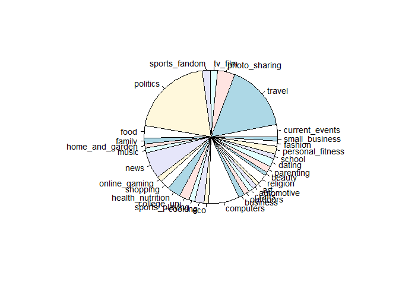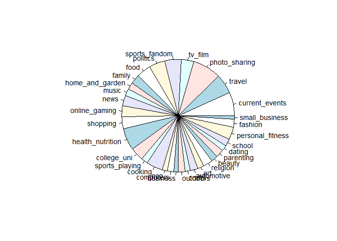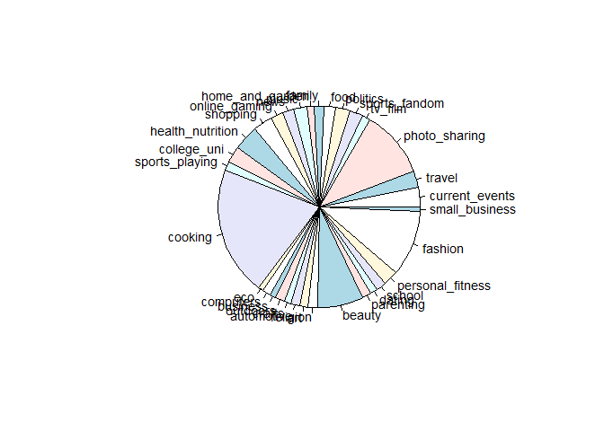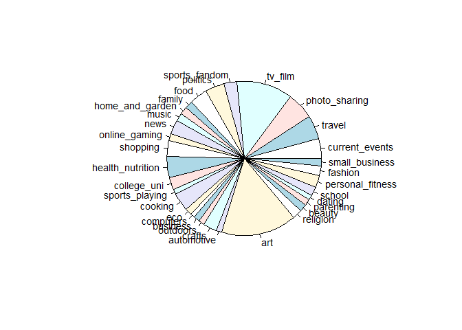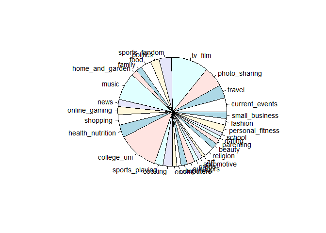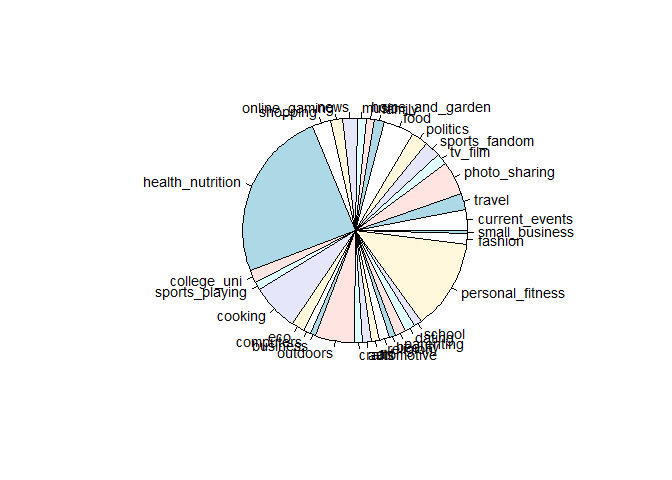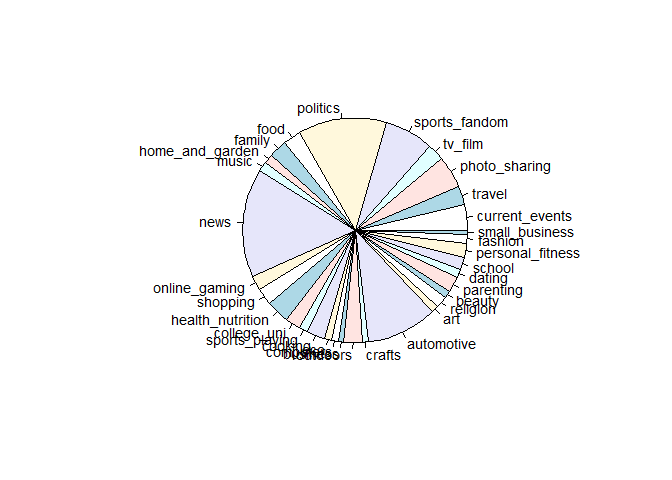

Based on the charts given above, here are the segments identified using K-Means:

1.  Dating, School, Fashion, Photosharing -
2.  Food, Religion, Parenting, Sports Fandom
3.  Politics, Travel, News, Computers
4.  Photo Sharing, Shopping, Current Events
5.  Photo Sharing, Travel, Health & Nutrition
6.  Cooking, Photo Sharing, Beauty, Fashion
7.  TV & Film, Art
8.  Online Gaming, College/University, Sports Playing
9.  TV & Film, College/University, Music
10. Health & Nutrition, Personal Fitness, Cooking, Outdoors
11. News, Automotive, Politics

#### **Principal Component Analysis**

When faced with a large set of correlated variables, principal components allow us to summarize this set with a smaller number of representative variables that collectively explain most of the variability in the original set. We now try reducing the variable dimensionality using PCA, identify the important Principal components (usually the first few) and then run Hierarchical clustering on these components

    ## Importance of components%s:
    ##                           PC1     PC2     PC3     PC4     PC5     PC6
    ## Standard deviation     2.0987 1.66483 1.59119 1.52912 1.46728 1.28477
    ## Proportion of Variance 0.1376 0.08661 0.07912 0.07307 0.06728 0.05158
    ## Cumulative Proportion  0.1376 0.22426 0.30338 0.37645 0.44372 0.49531
    ##                            PC7     PC8     PC9    PC10    PC11    PC12
    ## Standard deviation     1.21616 1.17377 1.05325 0.99329 0.96596 0.96133
    ## Proportion of Variance 0.04622 0.04305 0.03467 0.03083 0.02916 0.02888
    ## Cumulative Proportion  0.54153 0.58458 0.61925 0.65008 0.67924 0.70812
    ##                           PC13    PC14    PC15    PC16    PC17    PC18
    ## Standard deviation     0.93945 0.92125 0.90796 0.84582 0.80888 0.75382
    ## Proportion of Variance 0.02758 0.02652 0.02576 0.02236 0.02045 0.01776
    ## Cumulative Proportion  0.73570 0.76222 0.78798 0.81034 0.83079 0.84854
    ##                           PC19    PC20    PC21    PC22    PC23    PC24
    ## Standard deviation     0.69548 0.68732 0.65389 0.64963 0.63916 0.63190
    ## Proportion of Variance 0.01512 0.01476 0.01336 0.01319 0.01277 0.01248
    ## Cumulative Proportion  0.86366 0.87842 0.89178 0.90497 0.91774 0.93022
    ##                           PC25    PC26    PC27    PC28    PC29    PC30
    ## Standard deviation     0.61729 0.59925 0.59437 0.55190 0.48581 0.47790
    ## Proportion of Variance 0.01191 0.01122 0.01104 0.00952 0.00738 0.00714
    ## Cumulative Proportion  0.94212 0.95335 0.96439 0.97390 0.98128 0.98842
    ##                           PC31    PC32
    ## Standard deviation     0.43861 0.42223
    ## Proportion of Variance 0.00601 0.00557
    ## Cumulative Proportion  0.99443 1.00000

The variance explained by each principal component and the cumulative variance explained can be seen in the graph below

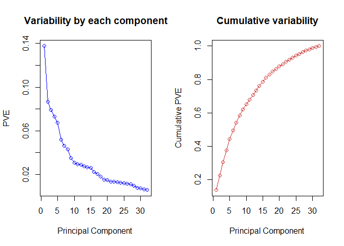

As we can see, first few components are not sufficient to explain the variability in the data.80% of the variability of our data can be explained with 16 principal components

#### **Hierarchical Clustering**

To provide more clarity and confirm the result of 11 potential market segmentations from the k-means method, we performed a Hierarchical Clustering algorithm to compare and determine what similarities would emerge. We use 16 principal components from PCA to perform heirarchical clustering. Since it is a market segment problem, we use correlation based distance and we try to experiment with three linkage methods : Single, Complete and Average

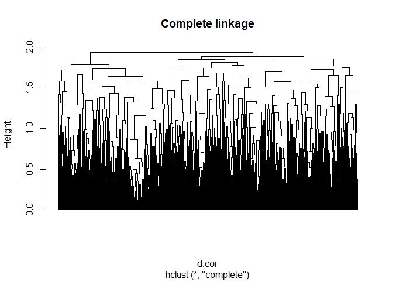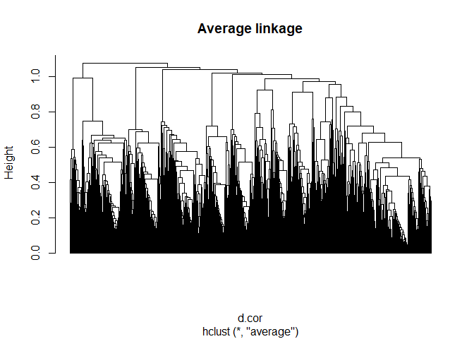

We decide to go with Average linkage method (or group method) clustering as it provides a trade off between the senstivity of complete linkage clustering to outliers and the tendency of single linkage clustering to form long chains that do not correspond to the intuitive notion of the clusters as compact, spherical objects

Looking at the tree, we can cut the tree at the height of 0.9 and then identify the clusters and no of entries in each cluster

    ## hc_clust_avg
    ##    1    2    3    4    5    6    7    8    9   10   11   12 
    ##  987  993  364 2114  430  526  734  260   63  537  354  520

Now we want to visualize the segments identified by hierarchical clustering

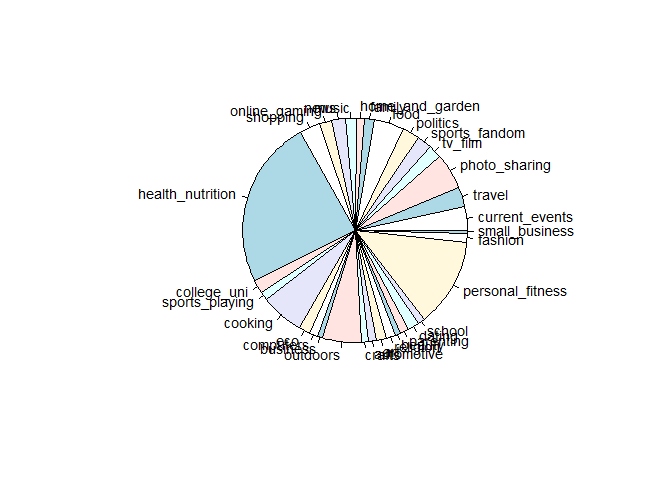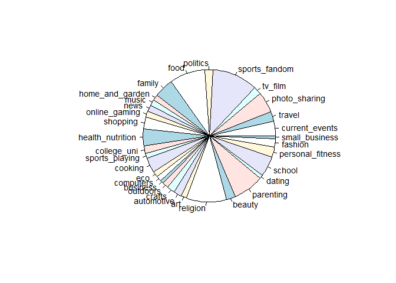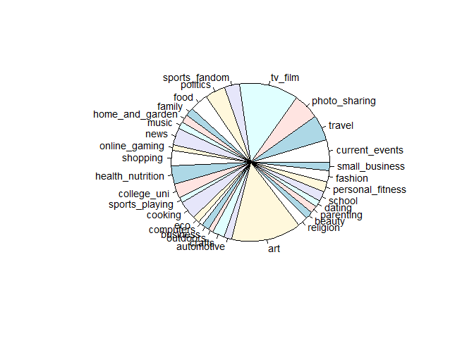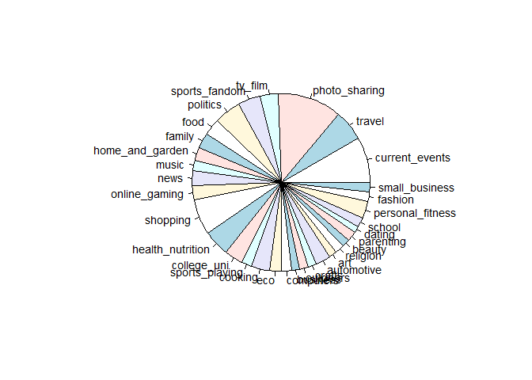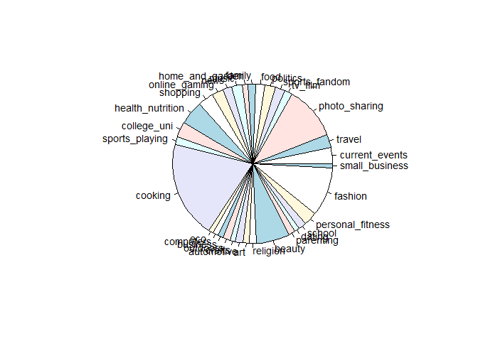

Based on the charts given above, here are the segments identified using Hierarchical Clustering:

1.  Health & Nutrition, Personal Fitness, Cooking, Outdoors
2.  Food, Religion, Parenting, Sports Fandom
3.  TV & Film, Art
4.  Photo Sharing, Shopping, Current Events, Travel
5.  Politics, Travel, News, Computers
6.  Cooking, Photo Sharing, Beauty, Fashion
7.  Dating, School, Fashion, Photo Sharing
8.  Home & Garden, Health Nutrition, College/University
9.  Online Gaming, College/University, Sports Playing
10. TV & Film, College/University, Music
11. News, Automotive, Politics, Sports Fandom

### **Insights and Recommendations**

The comprehensive approach described above was the analysis that went into uncovering insights that could be beneficial for NutrientH2O for the purposes of providing meaningful market segmentation. We used a cluster approach to define various market segments from the social media data presented.

The most desired insight to uncover is to explicitly state the distinct market segments that emerged from the analysis. Based on the K-Means and Hierarchical Clustering algorithms, we could come with 9 broad Market Segments:

1.  Dating, School, Fashion, Photo Sharing
2.  Food, Religion, Parenting, Sports Fandom
3.  Politics, Travel, News, Computers
4.  Photo Sharing, Shopping, Current Events, Travel
5.  Cooking, Photo Sharing, Beauty, Fashion
6.  Online Gaming, College/University, Sports Playing
7.  TV & Film, College/University, Music
8.  Health & Nutrition, Personal Fitness, Cooking, Outdoors
9.  News, Automotive, Politics, Sports Fandom

With this Market Segmentation knowledge in mind, NutrientH2O can design specific marketing campaigns to these 9 distinct audience members.

For example, it is highly likely that the demographic information for segment \#5 - 'Cooking, Photo Sharing, Beauty, Fashion' is vastly different than the demographic makeup of segment \#6 - 'Online Gaming, College/University, Sports Playing'. More specifically, based on substantive knowledge of those subject matters, it is fair to assume that segment \#5 is comprised of a larger female population than segment \#6. Therefore, NutrientH2O can use this market segmentation knowledge to their advantage by designing two separate marketing campaigns to address members of each segment \#5 and \#6 to convey the most compelling message.

Insights such as the one descrived can be invalubale to a firm in terms of strategic marketing, and we were able to leverage clustering algorithms for the purposes of identifying market segments. Our analysis was not only thorough, but also confirmed some of the initial intuition we had when first evaluating the dataset, and can be used by NutrientH2O to increase profitability.
