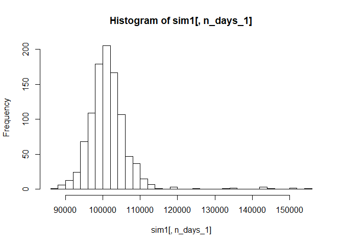
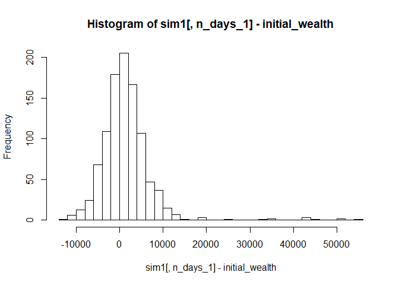

Hw3
================
Guanhua\_Zhang
2018/8/7

``` r
rm(list=ls())
#install.packages('quantmod')
library(quantmod)
```

    ## Warning: package 'quantmod' was built under R version 3.4.4

    ## Loading required package: xts

    ## Warning: package 'xts' was built under R version 3.4.4

    ## Loading required package: zoo

    ## Warning: package 'zoo' was built under R version 3.4.4

    ## 
    ## Attaching package: 'zoo'

    ## The following objects are masked from 'package:base':
    ## 
    ##     as.Date, as.Date.numeric

    ## Loading required package: TTR

    ## Warning: package 'TTR' was built under R version 3.4.3

    ## Version 0.4-0 included new data defaults. See ?getSymbols.

``` r
library(mosaic)
```

    ## Warning: package 'mosaic' was built under R version 3.4.4

    ## Loading required package: dplyr

    ## Warning: package 'dplyr' was built under R version 3.4.4

    ## 
    ## Attaching package: 'dplyr'

    ## The following objects are masked from 'package:xts':
    ## 
    ##     first, last

    ## The following objects are masked from 'package:stats':
    ## 
    ##     filter, lag

    ## The following objects are masked from 'package:base':
    ## 
    ##     intersect, setdiff, setequal, union

    ## Loading required package: lattice

    ## Loading required package: ggformula

    ## Warning: package 'ggformula' was built under R version 3.4.4

    ## Loading required package: ggplot2

    ## Warning: package 'ggplot2' was built under R version 3.4.4

    ## Loading required package: ggstance

    ## Warning: package 'ggstance' was built under R version 3.4.4

    ## 
    ## Attaching package: 'ggstance'

    ## The following objects are masked from 'package:ggplot2':
    ## 
    ##     geom_errorbarh, GeomErrorbarh

    ## 
    ## New to ggformula?  Try the tutorials: 
    ##  learnr::run_tutorial("introduction", package = "ggformula")
    ##  learnr::run_tutorial("refining", package = "ggformula")

    ## Loading required package: mosaicData

    ## Warning: package 'mosaicData' was built under R version 3.4.4

    ## Loading required package: Matrix

    ## 
    ## The 'mosaic' package masks several functions from core packages in order to add 
    ## additional features.  The original behavior of these functions should not be affected by this.
    ## 
    ## Note: If you use the Matrix package, be sure to load it BEFORE loading mosaic.

    ## 
    ## Attaching package: 'mosaic'

    ## The following object is masked from 'package:Matrix':
    ## 
    ##     mean

    ## The following object is masked from 'package:ggplot2':
    ## 
    ##     stat

    ## The following objects are masked from 'package:dplyr':
    ## 
    ##     count, do, tally

    ## The following objects are masked from 'package:stats':
    ## 
    ##     binom.test, cor, cor.test, cov, fivenum, IQR, median,
    ##     prop.test, quantile, sd, t.test, var

    ## The following objects are masked from 'package:base':
    ## 
    ##     max, mean, min, prod, range, sample, sum

``` r
library(foreach)
```

    ## Warning: package 'foreach' was built under R version 3.4.4

``` r
sp500 <- new.env()
SPY=getSymbols("SPY",auto.assign = FALSE, from = "2005-01-01",to='2018-01-01')
```

    ## 'getSymbols' currently uses auto.assign=TRUE by default, but will
    ## use auto.assign=FALSE in 0.5-0. You will still be able to use
    ## 'loadSymbols' to automatically load data. getOption("getSymbols.env")
    ## and getOption("getSymbols.auto.assign") will still be checked for
    ## alternate defaults.
    ## 
    ## This message is shown once per session and may be disabled by setting 
    ## options("getSymbols.warning4.0"=FALSE). See ?getSymbols for details.

    ## 
    ## WARNING: There have been significant changes to Yahoo Finance data.
    ## Please see the Warning section of '?getSymbols.yahoo' for details.
    ## 
    ## This message is shown once per session and may be disabled by setting
    ## options("getSymbols.yahoo.warning"=FALSE).

``` r
TLT=getSymbols("TLT",auto.assign = FALSE, from = "2005-01-01",to='2018-01-01')
LQD=getSymbols("LQD",auto.assign = FALSE, from = "2005-01-01",to='2018-01-01')
EEM=getSymbols("EEM",auto.assign = FALSE, from = "2005-01-01",to='2018-01-01')
VNQ=getSymbols("VNQ",auto.assign = FALSE, from = "2005-01-01",to='2018-01-01')

SPYa = adjustOHLC(SPY)
TLTa = adjustOHLC(TLT)
LQDa = adjustOHLC(LQD)
EEMa = adjustOHLC(EEM)
VNQa = adjustOHLC(VNQ)


all_returns_1 = cbind(ClCl(SPYa),ClCl(TLTa),ClCl(LQDa),ClCl(EEMa),ClCl(VNQa))
head(all_returns_1)
```

    ##               ClCl.SPYa     ClCl.TLTa     ClCl.LQDa     ClCl.EEMa
    ## 2005-01-03           NA            NA            NA            NA
    ## 2005-01-04 -0.012219459 -0.0104800543 -0.0056124454 -0.0307885599
    ## 2005-01-05 -0.006900614  0.0053524771  0.0008062713 -0.0122416742
    ## 2005-01-06  0.005084306  0.0006796217  0.0007161579 -0.0006797887
    ## 2005-01-07 -0.001433260  0.0022640368 -0.0004472940  0.0019361538
    ## 2005-01-10  0.004728115  0.0015811949 -0.0017003312  0.0012534287
    ##               ClCl.VNQa
    ## 2005-01-03           NA
    ## 2005-01-04 -0.015029523
    ## 2005-01-05 -0.033242471
    ## 2005-01-06  0.007703871
    ## 2005-01-07 -0.002237610
    ## 2005-01-10 -0.003176939

``` r
all_returns_1 = as.matrix(na.omit(all_returns_1))

return.today_1 = resample(all_returns_1, 1, orig.ids=FALSE)

initial_wealth = 100000
sim1 = foreach(i=1:1000, .combine='rbind') %do% {
    total_wealth_1 = initial_wealth
    weights_1 = c(0.2, 0.2, 0.2, 0.2, 0.2)
    holdings_1 = weights_1 * total_wealth_1
    n_days_1 = 20
    wealthtracker_1 = rep(0, n_days_1)
    for(today in 1:n_days_1) {
        return.today_1 = resample(all_returns_1, 1, orig.ids=FALSE)
        holdings_1 = holdings_1 + holdings_1*return.today_1
        total_wealth_1 = sum(holdings_1)
        wealthtracker_1[today] = total_wealth_1
    }
    wealthtracker_1
}

head(sim1)
```

    ##               [,1]      [,2]      [,3]     [,4]     [,5]      [,6]
    ## result.1 100973.95 100562.12 101451.63 101024.1 100756.0 104119.75
    ## result.2 100440.40 101145.48 101703.74 100388.1 100568.2 101207.24
    ## result.3 100617.40 100743.79 100303.63 101259.1 102011.4 101199.62
    ## result.4 100083.90 100110.51 100054.23 100247.1 100163.8 101562.17
    ## result.5 100808.03  98917.11  99042.46 104896.7 104939.5 104387.78
    ## result.6  98880.38  99218.88  99404.76  98441.6  99369.2  99884.45
    ##              [,7]      [,8]     [,9]     [,10]     [,11]     [,12]
    ## result.1 103923.8 104037.93 104269.8 103907.75 104493.98 104383.31
    ## result.2 100881.8  99665.58 100011.7  99890.12  99968.14  99997.75
    ## result.3 101289.2 100789.06 101659.5 102788.48 103140.94 103115.09
    ## result.4 101560.4 101638.55 102113.2  94234.64  94079.86  93698.32
    ## result.5 104433.3 103978.54 103666.7 104237.58 104367.32 104528.80
    ## result.6 100286.7 100947.74 101295.2 102380.63 102232.10 102237.15
    ##              [,13]     [,14]     [,15]     [,16]     [,17]     [,18]
    ## result.1 104173.85 104086.59 104170.80 104133.60 103670.07 103303.02
    ## result.2  99467.04  99765.62  99804.08 100249.65 100534.67 100659.22
    ## result.3 102494.35 102504.95 102160.74 102251.84 102951.67 103160.28
    ## result.4  94237.15  94243.48  94371.29  94940.06  95621.30  95643.18
    ## result.5 105559.01 105921.11 106878.81 106801.04 106026.28 106463.11
    ## result.6 100055.96  99807.31  98711.79  98597.39  98408.92  98286.57
    ##              [,19]     [,20]
    ## result.1 103383.91 103336.64
    ## result.2 101524.53 101877.29
    ## result.3 103074.05 103349.20
    ## result.4  95445.34  95576.62
    ## result.5 106635.41 107397.12
    ## result.6  98685.83  98913.02

``` r
hist(sim1[,n_days_1], 25)
```



``` r
# Profit/loss
mean(sim1[,n_days_1])
```

    ## [1] 101471.8

``` r
hist(sim1[,n_days_1]- initial_wealth, breaks=30)
```



``` r
# Calculate 5% value at risk
quantile(sim1[,n_days_1], 0.05) - initial_wealth
```

    ##        5% 
    ## -5746.655

``` r
# all_returns_2 = cbind(ClCl(SPYa),ClCl(TLTa),ClCl(LQDa),ClCl(EEMa))
# head(all_returns_2)
# all_returns_2 = as.matrix(na.omit(all_returns_2))
# 
# return.today_2 = resample(all_returns_2, 1, orig.ids=FALSE)
# 
# initial_wealth = 100000
# sim2 = foreach(i=1:1000, .combine='rbind') %do% {
#   total_wealth_2 = initial_wealth
#   weights_2 = c(0.25, 0.25, 0.25, 0.25)
#   holdings_2 = weights_2 * total_wealth_2
#   n_days_2 = 20
#   wealthtracker_2 = rep(0, n_days_2)
#   for(today in 1:n_days_2) {
#       return.today_2 = resample(all_returns_2, 1, orig.ids=FALSE)
#       holdings_2 = holdings_2 + holdings_2*return.today_2
#       total_wealth_2 = sum(holdings_2)
#       wealthtracker_2[today] = total_wealth_2
#   }
#   wealthtracker_2
# }
# 
# head(sim2)
# hist(sim2[,n_days_2], 25)
# 
# # Profit/loss
# mean(sim2[,n_days_2])
# hist(sim2[,n_days_2]- initial_wealth, breaks=30)
# 
# # Calculate 5% value at risk
# quantile(sim2[,n_days_2], 0.05) - initial_wealth
# ```
# 
# 
# ```{r}
# all_returns_3 = cbind(ClCl(EEMa),ClCl(VNQa))
# head(all_returns_3)
# all_returns_3 = as.matrix(na.omit(all_returns_3))
# 
# return.today_3 = resample(all_returns_3, 1, orig.ids=FALSE)
# 
# initial_wealth = 100000
# sim3 = foreach(i=1:1000, .combine='rbind') %do% {
#   total_wealth_3 = initial_wealth
#   weights_3 = c(0.5, 0.5)
#   holdings_3 = weights_3 * total_wealth_3
#   n_days_3 = 20
#   wealthtracker_3 = rep(0, n_days_3)
#   for(today in 1:n_days_3) {
#       return.today_3 = resample(all_returns_3, 1, orig.ids=FALSE)
#       holdings_3 = holdings_3 + holdings_3*return.today_3
#       total_wealth_3 = sum(holdings_3)
#       wealthtracker_3[today] = total_wealth_3
#   }
#   wealthtracker_3
# }
# 
# head(sim3)
# hist(sim3[,n_days_3], 25)
# 
# # Profit/loss
# mean(sim3[,n_days_3])
# hist(sim3[,n_days_3]- initial_wealth, breaks=30)
# 
# # Calculate 5% value at risk
# quantile(sim3[,n_days_3], 0.05) - initial_wealth
```
